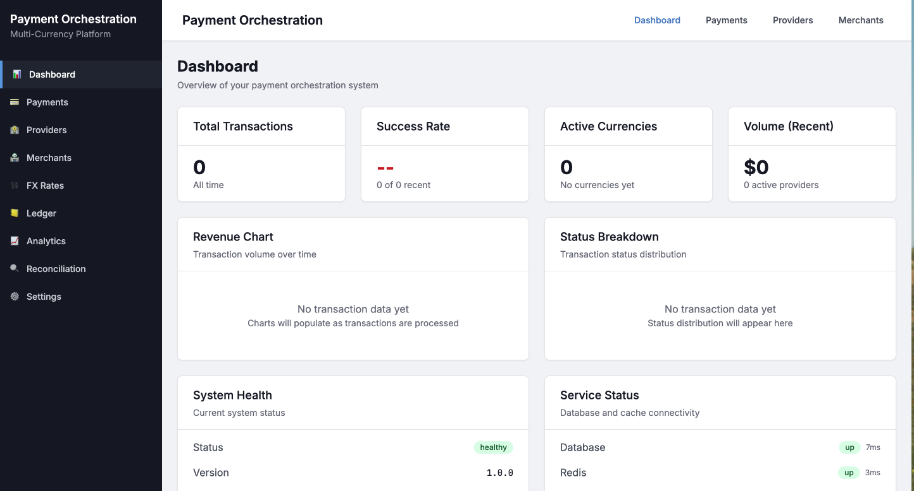

# Multi-Currency Payment Orchestration System

## Project Overview
Born out of my deep dive into Digital Payments and Innovation (IS430), the **Multi-Currency Payment Orchestration System (MCPOS)** is a B2B platform designed to solve the inefficiencies of single-provider dependency. Instead of routing all transactions through a default gateway, MCPOS acts as an intelligent decision engine that dynamically selects the optimal payment route based on real-time currency rates, provider health, and fee structures. This ensures merchants always get the lowest fees and highest success rates, while providing redundancy against provider outages that would otherwise result in lost revenue.

## Value Proposition: 
1. **Lower Fees**. Stripe might charge 3% for international cards, PayPal charges 4% while local provider 1%. Therefore, this system routes the transaction to the cheapest option for that specific customer's currency/card, saving the business massive amounts of money at scale. 
2. **Higher Success Rates (Revenue Uplift)**. Sometimes a bank declines a transaction because the payment processor is foreign. Therefore, the idea is to route a German customer's payment through a European processer, improving the chance that the bank will approve it. 
3. **Zero Downtime (Redundancy)**. If Stripe is down, the system can automatically route transactions to PayPal or another provider, ensuring that the business never loses a sale due to a payment processor outage. 
4. **Single Integration**. Integrating Stripe, Paypal, Adyen and Checkout.com can take months of engineering work. Through this platform, the business can integrate through the API once and get access to all those providers behind the scene. 

## Core Features

**1. Payment Gateway Orchestration**
- Integrate with 2-3 payment provider APIs (Stripe, PayPal Sandbox, or similar test environments)
- Implement intelligent routing logic that selects the optimal provider based on:
  - Transaction amount and currency
  - Geographic location
  - Provider success rates and fees
  - Provider availability (fallback mechanism)

**2. Multi-Currency Support**
- Real-time FX rate fetching from a public API (e.g., exchangerate-api.io)
- Currency conversion calculator with spread margins
- Support for at least 5 major currencies (USD, EUR, GBP, SGD, JPY)
- Historical FX rate tracking and visualization

**3. Transaction Monitoring Dashboard**
- Real-time transaction status tracking
- Success/failure rate analytics by provider and currency
- Transaction timeline visualization
- Fraud detection simulation (flag suspicious patterns like rapid repeated transactions)

**4. Payment Method Management**
- Support multiple payment methods (cards, wallets, bank transfers)
- Tokenization simulation for storing payment credentials securely
- Payment method preference settings per user/region

**5. Reconciliation Module**
- Generate transaction reports
- Settlement status tracking
- Discrepancy detection between expected and actual amounts

## Key Learnings & Technical Skills

### 1. Financial Domain Knowledge
- **Payment Routing**: Understanding how to dynamically route transactions to minimize fees and maximize success rates.
- **Ledger & Reconciliation**: Implementing double-entry accounting principles to ensure financial accuracy and identifying discrepancies between internal records and provider statements.
- **Foreign Exchange (FX)**: Handling multi-currency transactions, understanding spread, and real-time rate management.
- **Compliance & Security**: Concepts of tokenization (PCI-DSS compliance) and fraud detection patterns.

### 2. Backend Engineering
- **Modular Monolith Architecture**: Designing a system that is easy to develop locally but ready to be split into microservices (Payment, Ledger, FX services) as it scales.
- **Concurrency & Locking**: Handling race conditions in financial transactions to prevent double-spending or invalid balance updates.
- **Database Design**: Using PostgreSQL for ACID-compliant transactional integrity and Redis for high-performance caching of session data and FX rates.

### 3. Frontend & UX
- **Real-Time Dashboards**: Visualizing complex financial data using React and Recharts with low latency.
- **Optimistic UI**: Improving perceived performance while ensuring data consistency in the background.

## Technical Stack

**Backend**
- **Language**: TypeScript (Node.js)
- **Framework**: Express.js
- **Database**: PostgreSQL (Transactional), Redis (Caching)
- **Architecture**: Modular Monolith / Microservices ready

**Frontend**
- **Framework**: React (Vite)
- **Styling**: TailwindCSS
- **Visualization**: Recharts/Chart.js

## Project Roadmap

### Phase 1: Foundation
- Project scaffolding
- Database schema design
- Basic API setup

### Phase 2: Core Payment Logic
- Mock Provider integrations
- Routing engine implementation
- FX Service integration

### Phase 3: Frontend Dashboard
- Dashboard UI implementation
- Real-time data integration

### Phase 4: Advanced Features
- Monitoring and Analytics
- Reconciliation module
